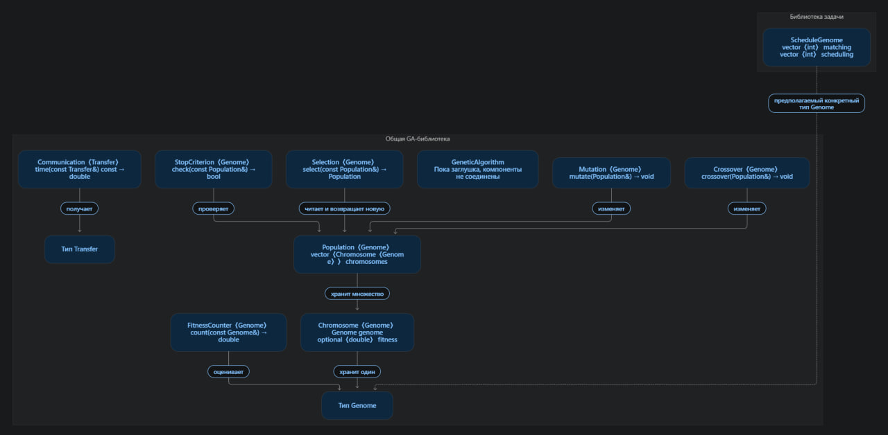

# Генетический алгоритм для построения расписаний

## Структура проекта

- `genetic_algorithm/` — общие типы и абстрактные интерфейсы генетического алгоритма.
- `heterogeneous_machines/` — реализация задачи расписания, распределение подзадач по машинами.

## Текущая схема

Уточнение к схеме: текущий метод `FitnessCounter::count` принимает `const Chromosome<Genome>&` и возвращает `double`. Результат сохраняет вызывающий код: `chromosome.fitness = counter.count(chromosome);`.

